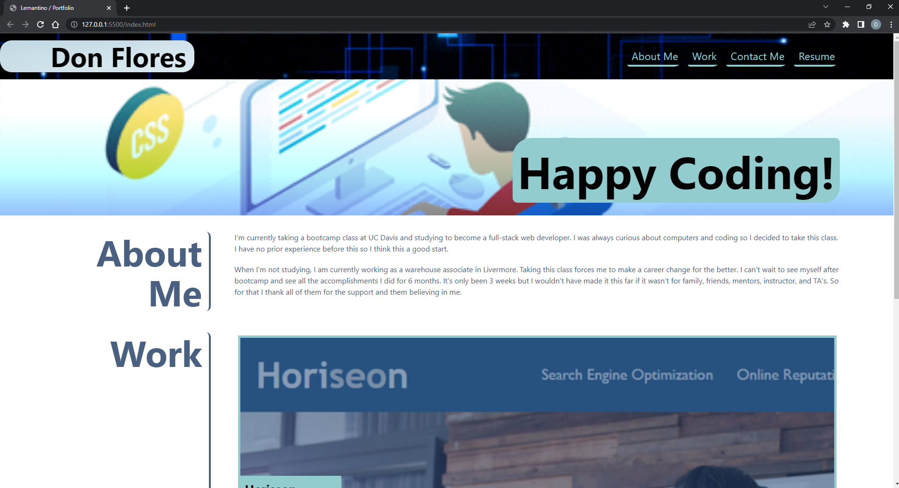

# Dons-Portfolio
[Deployed Link Here](https://donflores.github.io/Dons-Portfolio/)

## Description

This project was created so I can have a portfolio when I'm done with bootcamp and I can use this to present myself for future employers. In due time make it look better as well. It contains HTML, CSS variables, flexbox, and media queries. 

## Installation

N/A

## Usage

To use this website to contact me and a short story about me.

## Credits

N/A

## License

N/A

## Screenshot of the page

The following image shows the websites current state.

